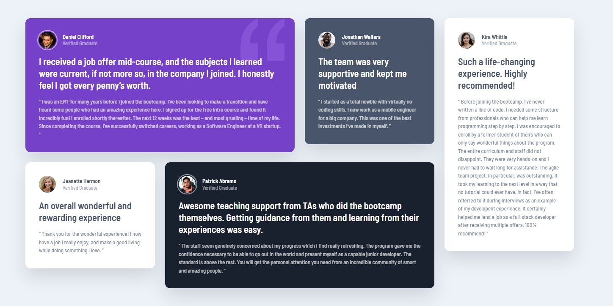
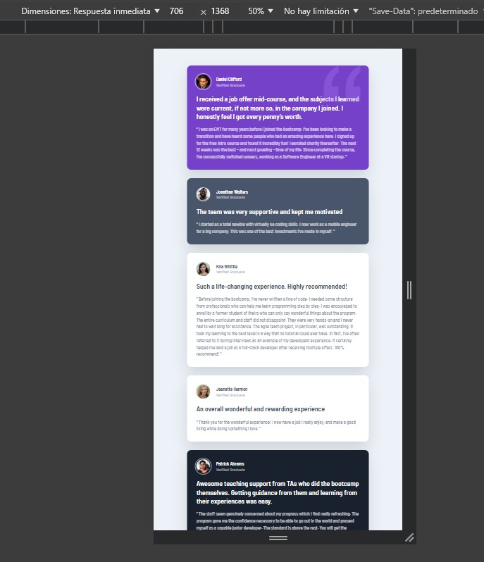

# Frontend Mentor – Testimonials Grid Section Solution

This is a solution to the **Testimonials Grid Section** challenge on Frontend Mentor.  
Frontend Mentor challenges help improve front-end skills by building realistic projects using modern best practices.

---

## Table of Contents

- [Overview](#overview)
  - [The Challenge](#the-challenge)
  - [Screenshot](#screenshot)
  - [Links](#links)
- [My Process](#my-process)
  - [Built With](#built-with)
  - [What I Learned](#what-i-learned)
  - [Continued Development](#continued-development)
- [Author](#author)
- [Acknowledgments](#acknowledgments)

---

## Overview

### The Challenge

Users should be able to:

- View the optimal layout depending on their device’s screen size
- See a responsive testimonial grid layout for both mobile and desktop
- Experience a clean, accessible, and visually consistent UI

---

### Screenshot

---

### Links

- **Solution URL:**  
  https://github.com/jaseff2805/FrontEndMentor_TestimonialGridSection_Jaseff2805

- **Live Site URL:**  
  https://jaseff2805.github.io/FrontEndMentor_TestimonialGridSection_Jaseff2805/

---

## My Process

### Built With

- Semantic HTML5
- CSS Custom Properties (Variables)
- CSS Grid
- Flexbox
- Mobile-first workflow
- Bootstrap 5
- Modern CSS features (`clamp()`, logical properties)
- Accessible markup and scalable CSS architecture

---

### What I Learned

In this project, I reinforced how much impact **CSS architecture** has on the final result, even when the HTML structure is relatively simple.

Key learnings include:

- How to use **CSS custom properties (`--variables`)** to create a centralized and scalable design system.
- Structuring components using a **base + modifier pattern** (`.t-card` and `.t-card--variant`) inspired by BEM methodology.
- Leveraging **CSS Grid with `grid-template-areas`** to reproduce complex editorial layouts cleanly and efficiently.
- Using modern CSS functions like `clamp()` to create fluid, responsive spacing and typography without excessive media queries.
- Understanding how small visual details (shadows, opacity, decorative pseudo-elements) significantly enhance perceived quality.

This project confirmed that well-structured CSS is often the key difference between a layout that “works” and one that truly matches the intended design.

---

### Continued Development

In future projects, I want to continue focusing on:

- Refining CSS architecture for scalability and maintainability
- Exploring deeper accessibility improvements (ARIA roles, contrast validation)
- Reducing custom CSS further by leveraging Bootstrap utilities more effectively
- Building small reusable design systems based on CSS variables

---

## Author

- GitHub: [@jaseff2805](https://github.com/jaseff2805)
- Frontend Mentor: [@jaseff2805](https://www.frontendmentor.io/profile/jaseff2805)

---

## Acknowledgments

Thanks to **Frontend Mentor** for providing well-designed challenges that encourage best practices in modern front-end development and help reinforce both technical and design-oriented thinking.
